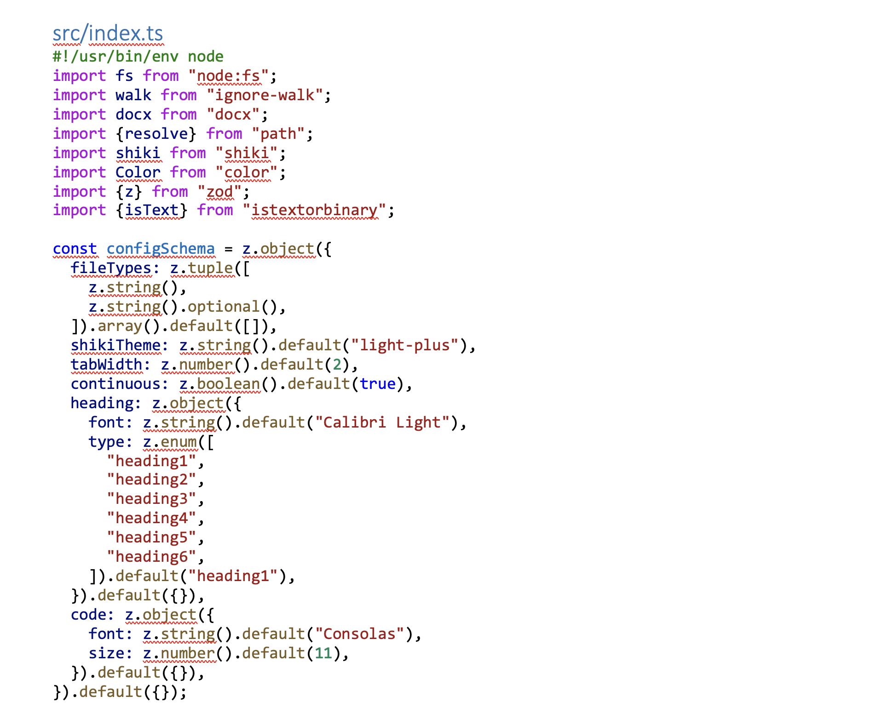

# Code2Docx



Code2Docx is a tool that generates Word documents from code.

It uses [Shiki](https://shiki.matsu.io/) for Syntax Highlighting, and [Docx](https://docx.js.org/) for generating the Word document.

### Usage

```bash
npx code2docx@latest [folder]
```

or install globally with

```bash
npm i -g code2docx@latest
# Then run with
code2docx [folder]
```

### Configuration

#### Ignore Files

Code2Docx will ignore all files listed in your `.gitignore`.

If you want to ignore files only for Code2Docx, you can create a `.code2docxignore` file with the same syntax as a `.gitignore`.

#### Other Configuration

You can create a `.code2docx.json` configuration file in your project root.

An example is below:

```json
{
  "shikiTheme": "nord",
  "fileTypes": [
    ["xml", "xml"],
    ["/yarn\\.lock$/", "yaml"]
  ],
  "tabWidth": 4,
  "continuous": true,
  "heading": {
    "font": "Consolas",
    "type": "heading1"
  },
  "code": {
    "font": "JetBrains Mono",
    "size": 12
  }
}
```
